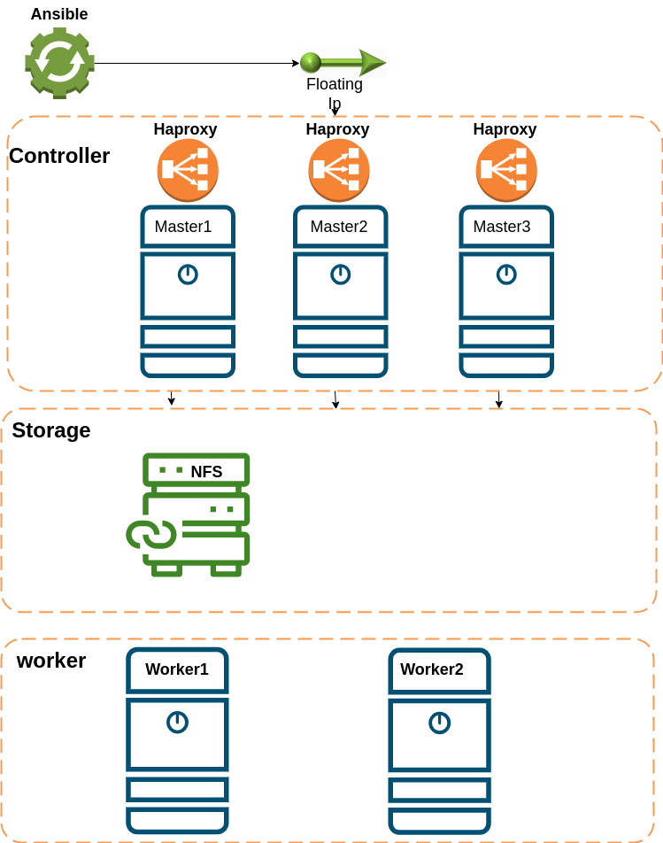

This project helps you to deploy Kubernetes on Linux without a load balancer on cloud platforms.



## Requirements for deploying a Kubernetes cluster


* OS: Ubuntu (20.04)
* CPU: 2 core (per server)
* Ram: 2 GB (per server)
* Storage 25G (per server)

### How to use it


#### How to Use It
Follow the steps below to use this deployment project:
Install Ansible on your client or deployment machine:

```bash
sudo apt update
sudo apt install software-properties-common
sudo add-apt-repository --yes --update ppa:ansible/ansible
sudo apt install ansible
```

* Note:  Copy the SSH key to your servers (master, worker, and storage):

``` bash
   # Generate SSH key
   ssh-keygen
   # Copy SSH key to servers
   ssh-copy-id mater1 or your serverip
   ssh-copy-id mater2 or your serverip
   ssh-copy-id mater3 or your serverip
   ssh-copy-id woker1 or your serverip
   ssh-copy-id woker2 or your serverip
   ssh-copy-id storage or your serverip
   ssh-copy-id ha1 or your serverip
   ssh-copy-id ha2 or your serverip
   ssh-copy-id ha3 or your serverip
```

* Note: Replace your_server_ip with the actual IP address of each server.
* Change the hostname on your servers:

```bash
  ssh master1 hostnamectl set-hostname master1
  ssh master2 hostnamectl set-hostname master2
  ssh master3 hostnamectl set-hostname master3
  ssh worker1 hostnamectl set-hostname worker1
  ssh worker2 hostnamectl set-hostname worker2
  ssh storage hostnamectl set-hostname storage
  ssh ha1 hostnamectl set-hostname ha1
  ssh ha2 hostnamectl set-hostname ha2
  ssh ha3 hostnamectl set-hostname ha3

```

* Note: Before deploying Kubernetes with Ansible, update the variables in the default/main.yml file according to your infrastructure:

``` yaml
vim deault/main.yml

keepalive_ip : "172.16.16.200"
interface_name: "eth0"
pod_network_cidr: "192.168.0.0/16"
master1: "172.16.16.88"
master2: "172.16.16.104"
master3: "172.16.16.184"
storage_export: "172.16.104.0/24"

```

* Note: Modify the inventory file to match your infrastructure:

```yaml
vim inventroy
[preinstall]
172.16.16.88  ansible_user=root
172.16.16.104   ansible_user=root
172.16.16.184  ansible_user=root
172.16.16.111  ansible_user=root
172.16.16.80  ansible_user=root

[master]
172.16.16.88  ansible_user=root
172.16.16.104   ansible_user=root
172.16.16.184  ansible_user=root

[worker]
172.16.16.111  ansible_user=root
172.16.16.80  ansible_user=root

[storage]
172.16.16.86  ansible_user=root


[init_cluster]
172.16.16.88  ansible_user=root

```

### Deploy the preinstall configuration on master and worker nodes:

``` bash
ansible-playbook -i inventory -e 'machine=preinstall' --tag preinstall run.yaml

```

### Deploy the load balancer and virtual IP (keepalive) on the master nodes:

```bash
ansible-playbook -i inventory --tag loadbalancer -e 'machine=loadbalancer' run.yaml

```

### Initialize the Kubernetes cluster:

```bash
ansible-playbook -i inventory --tag master1 -e 'machine=cluster_init' run.yaml

```

### Deploy the Weave Network:

```bash
ansible-playbook -i inventory --tag network -e 'machine=cluster_init' run.yaml
```

* Note: After that run blow Comand to check your system's Pod

### Check the Pods in your system:

``` bash
kubectl get pods -o wide -n kube-system
```

* If you encounter any errors, you can use the --limit parameter to rerun Ansible on specific hosts:

```bash
ansible-playbook -i inventory -e 'machine=preinstall' run.yaml --limit master or worker

```

### Deploy the Network Storage Functionality (NSF) on the storage server:

```bash
ansible-playbook -i inventory --tag storage -e 'machine=storage' run.yaml
```


### Join new workers to the Kubernetes cluster:

``` bash
ansible-playbook -i inventory --tag worker_init -e 'machine=worker_init' run.yaml
```

### Join new masters to the Kubernetes cluster:

```bash
ansible-playbook -i inventory --tag master_init -e 'machine=master_init' run.yaml
```


These steps will guide you through deploying a Kubernetes cluster without a load balancer using the provided Ansible playbook. Make sure to follow each step carefully and adapt the configurations according to your specific infrastructure.

Note: The instructions assume that you have basic knowledge of Linux, networking, and Kubernetes concepts.
